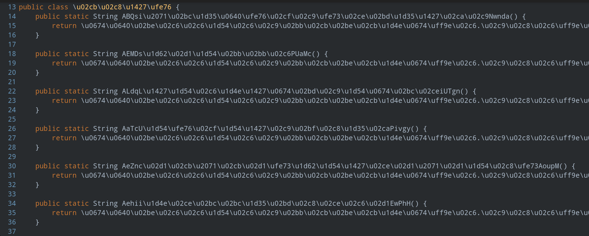

# CrackMeAPK
 
<H1>Hard CTF For Reverse Engineering APK File</H1>
<H2>I challenge Reverse engineering. Come find the <b>three hidden strings</b> in my application and you'll be mentioned in the project according to the string or strings you found!</H2>

<H2>How do you know you found something?</H2>
<H4>The things that are hidden in it already clearly indicate that they are hidden, and the things that are hidden look like passwords. They consist of mixed characters.</H4>
<H5>Example: HiddenY!n3nx^x98NX374xd|93</H5>

 

 
<H1>Application protections:</H1> 
<ol>
  <li><H3>DEX Obfuscation</H3></li>
  <li><H3>Code Obfuscation</H3></li>
  <li><H3>String Encryption</H3></li>
  <li><H3>ROOT Check</H3></li>
  <li><H3>Emulator Check</H3></li>
  <li><H3>SHA-1 Check</H3></li>
</ol>
 
<H3>1. String's Founder:<H3>
<H5>(String level:Almost impossible to find)<H5>
<H6>N/A</H6>
  
 

<H3>2. String's Founder:<H3>
<H5>(String level:Hard to find)<H5>
<H6>N/A</H6>
 
 
  
<H3>3. String's Founder:<H3>
<H5>(String level:EASY to find)</H5>
<H6>N/A</H6>

<H5>Okay. It's not open source, I'm sorry, but I found it right to publish such an app on GitHub.</H5>
<H4>Good luck...</H4>
